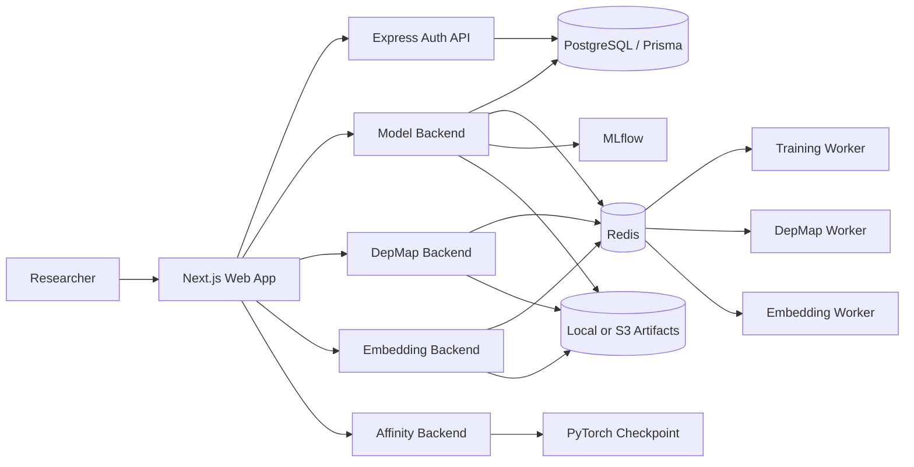

# Gene Web Bioinformatics Platform
## Project Work Report and Resume Source Document

**Prepared:** September 2026  
**Purpose:** Technical project record and source material for generating accurate resume bullets

> This document summarizes capabilities evidenced in the repository. It distinguishes implemented code from deployment documentation and identifies incomplete or inconsistent areas so resume claims remain defensible. Secrets and private environment values are intentionally excluded.

## 1. Executive Summary

Gene Web is a modular bioinformatics and machine-learning platform for exploring gene/drug relationships, training configurable predictive models, generating molecular and protein embeddings, and predicting drug-gene affinity. It is organized as a Turborepo monorepo with a Next.js web application, an Express/TypeScript authentication service, four FastAPI/Python services, shared TypeScript packages, Prisma/PostgreSQL persistence, Redis/RQ asynchronous workers, MLflow experiment tracking, Docker packaging, and Kubernetes/direct-VM deployment assets.

The platform brings together:

- User authentication and per-user experiment/dataset ownership.
- Upload and management of CSV datasets.
- Configurable classification and regression experiments.
- Reusable preprocessing, feature selection, cross-validation, metrics, and serialized model artifacts.
- Drug and protein/gene representation generation using multiple pretrained or local embedding methods.
- PyTorch-based drug-gene affinity inference from embedding CSV files.
- DepMap, GDSC, CTRP, and PRISM data integration for gene-drug association analysis.
- Background execution for expensive training, embedding, and DepMap workflows.
- Experiment tracking and downloadable artifacts.
- Deployment paths for Docker, Kubernetes/EKS, local k3s, and an Ubuntu VM managed with PM2/Nginx.

## 2. Product and Scientific Problem

The application provides a single workflow for bioinformatics users who need to move from biological data to model results and downstream interpretation:

1. Authenticate and create an account.
2. Upload a tabular dataset and inspect its metadata.
3. Configure a machine-learning experiment for classification or regression.
4. Apply quality-control and preprocessing operations.
5. Run training asynchronously and monitor progress from the dashboard.
6. Review metrics, selected features, and ranked-gene outputs.
7. Generate molecular/protein embeddings or upload existing embeddings.
8. Run affinity prediction for drug-gene pairs.
9. Query DepMap-related expression and drug-sensitivity associations.
10. Download CSV, model, embedding, or bundled ZIP artifacts.

The implementation is particularly suited to exploratory computational biology workflows because users can choose the model family, preprocessing behavior, validation strategy, and feature-selection method per experiment rather than using a single fixed model.

## 3. High-Level Architecture

### Monorepo organization

- `apps/web`: Next.js frontend and frontend API routes.
- `apps/auth_backend`: Express/TypeScript authentication service.
- `apps/model_backend`: FastAPI service for dataset management and model training.
- `apps/depmap_backend`: FastAPI service and worker orchestration for DepMap analysis.
- `apps/embedding_backend`: FastAPI service for drug/protein embedding generation.
- `apps/affinity_backend`: FastAPI inference service for drug-gene affinity.
- `apps/affinity`: model checkpoint and affinity research assets.
- `apps/depmap`: core DepMap association analysis code and datasets.
- `apps/embedding_bundle`: model assets, scripts, and embedding-generation resources.
- `packages/db`: Prisma schema and database package.
- `packages/config`, `packages/dotenv-path`, `packages/types`, `packages/ui`, `packages/zod-scemma`, and TypeScript/ESLint configuration packages: shared project infrastructure.

## 4. Service Inventory

| Component | Technology | Responsibility | Evidence |
|---|---|---|---|
| Web frontend | Next.js, React, TypeScript | Authentication, dashboards, experiment configuration, polling, visual results, downloads | [apps/web](apps/web) |
| Auth backend | Express, TypeScript, Zod, bcrypt, JWT | Signup, signin, password hashing, token issuance, user identity | [apps/auth_backend/src/index.ts](apps/auth_backend/src/index.ts) |
| Model backend | FastAPI, pandas, scikit-learn, XGBoost | Dataset APIs, experiment creation, training orchestration, metrics and artifacts | [apps/model_backend](apps/model_backend) |
| DepMap backend | FastAPI, Redis/RQ, Python data pipeline | Association-job creation, status, caching, and result downloads | [apps/depmap_backend](apps/depmap_backend) |
| Embedding backend | FastAPI, Transformers and scientific ML tooling | Molecular and protein sequence embeddings and bundles | [apps/embedding_backend](apps/embedding_backend) |
| Affinity backend | FastAPI, PyTorch, pandas | Embedding CSV validation and drug-gene affinity inference | [apps/affinity_backend](apps/affinity_backend) |
| Database | PostgreSQL, Prisma | Users, datasets, training runs, artifact references, DepMap mappings | [packages/db/prisma/schema.prisma](packages/db/prisma/schema.prisma) |
| Queue | Redis, RQ | Background training, DepMap, and embedding jobs | Worker directories under [apps](apps) |
| Experiment tracking | MLflow | Parameters, metrics, warnings, and model/artifact logging | [apps/model_backend/pipeline/pipeline.py](apps/model_backend/pipeline/pipeline.py) |

## 5. Authentication and Authorization

The Express authentication service implements:

- Signup and signin endpoints.
- Request validation using Zod schemas.
- Password hashing with bcrypt.
- PostgreSQL persistence through Prisma.
- JWT access-token issuance with expiration.
- Claims including subject, email, scope, issuer, and audience.

The frontend login flow is implemented in [apps/web/app/login/page.tsx](apps/web/app/login/page.tsx). Python services use dependency-based JWT validation in their service-specific `auth/deps.py` modules and enforce authenticated access to user-scoped workflows.

User ownership is represented in the Prisma data model. Dataset and training-run operations are associated with users, allowing the application to list and retrieve user-owned resources rather than exposing one global experiment namespace.

## 6. Dataset and Experiment Workflow

### Dataset management

Implemented in [apps/model_backend/routers/datasets.py](apps/model_backend/routers/datasets.py), [apps/model_backend/routers/dataset.py](apps/model_backend/routers/dataset.py), and [apps/model_backend/storage/storage.py](apps/model_backend/storage/storage.py):

- Multipart CSV upload.
- Filename sanitization.
- Per-user dataset directories.
- CSV row and column counting.
- Dataset metadata persistence.
- Dataset listing filtered by authenticated user.
- Optional S3-backed storage through the storage abstraction.

### Experiment configuration

The dashboard and experiment form expose controls for:

- Classification or regression task type.
- Train/test split ratio.
- Cross-validation fold count.
- Model family selection.
- Missing-value behavior.
- Feature scaling.
- Numeric log transformation.
- Outlier removal.
- Quality-control filtering.
- Categorical encoding.
- Feature selection.
- Arbitrary model hyperparameters.

The frontend submits the configuration, displays job status through polling, renders metrics and selected features, and supports ranked-gene CSV download. Main frontend evidence is [apps/web/app/dashboard/page.tsx](apps/web/app/dashboard/page.tsx), [NewExperimentForm.tsx](apps/web/app/dashboard/components/NewExperimentForm.tsx), and [useExperiment.ts](apps/web/hooks/useExperiment.ts).

## 7. Machine-Learning Training Pipeline

The main implementation is [apps/model_backend/pipeline/pipeline.py](apps/model_backend/pipeline/pipeline.py), with request and model options defined in [apps/model_backend/scemma/model.py](apps/model_backend/scemma/model.py).

### Input and preparation

The pipeline supports CSV and Parquet-style tabular inputs. It performs configurable preparation steps including:

- Row-level missingness filtering.
- Drop-row or imputation strategies.
- Numeric and categorical preprocessing.
- IQR, z-score, and percentile outlier handling.
- Standard, MinMax, Robust, and MaxAbs scaling.
- Numeric log transformation.
- One-hot categorical encoding.
- Quality-control filtering.
- Train/test partitioning.
- Stratification for classification splits where appropriate.

### Supported model families

The model registry supports six families:

1. Random Forest.
2. Support Vector Machine.
3. Multilayer Perceptron neural network.
4. Gradient Boosting.
5. Logistic Regression.
6. XGBoost.

This combination covers tree ensembles, kernel-based learning, linear classification, neural networks, and gradient-boosted decision trees.

### Validation and metrics

The pipeline uses train/test evaluation and cross-validation through scikit-learn utilities. Classification metrics include:

- Accuracy.
- Weighted precision.
- Weighted recall.
- F1 score.
- ROC AUC where applicable.
- Cross-validation mean and standard deviation.

Regression metrics include:

- R-squared.
- Mean squared error.
- Root mean squared error.
- Cross-validation mean and standard deviation.

Metrics are converted into JSON-safe values before database persistence, reducing problems caused by NumPy scalar types.

### Feature selection and biological outputs

The exposed feature-selection options include:

- LASSO.
- Random Forest importance.
- Permutation importance.
- Integrated gradients.

The currently evidenced selector construction implements LASSO and Random Forest importance. Permutation importance and integrated gradients are exposed in the schema/UI but do not currently construct active selectors in the observed pipeline. The generated selected-feature and ranked-gene artifacts should therefore be described as feature-ranking outputs, not as a complete explainability suite.

The pipeline writes selected-feature data and a ranked-gene CSV. The current top-gene representation is based on selected/transformed feature names; expression, p-value, and fold-change fields are returned as null in the observed implementation.

## 8. Drug and Protein/Gene Embeddings

The embedding service is implemented in [apps/embedding_backend/services/embedding_service.py](apps/embedding_backend/services/embedding_service.py), with local model and bundle resources under [apps/embedding_bundle](apps/embedding_bundle).

### Drug representation methods

- Uni-Mol molecular embeddings.
- Mol2Vec molecular embeddings.
- GIN/GROVER graph-based representations.

### Protein/gene representation methods

- ESM2 protein language-model embeddings.
- ProtBERT protein language-model embeddings.
- ProtVec sequence embeddings.

### API and artifact behavior

The service:

- Validates SMILES strings and protein sequences.
- Supports synchronous and asynchronous embedding operations.
- Caches loaded models per process to reduce repeated initialization cost.
- Produces individual CSV artifacts.
- Produces combined CSV artifacts.
- Supports optional vector inclusion.
- Provides ZIP bundle downloads.
- Supports local or optional S3 artifact handling.

The frontend molecular lookup and embedding workflow is visible in [apps/web/app/dashboard/depmap/compound/embeddings/page.tsx](apps/web/app/dashboard/depmap/compound/embeddings/page.tsx) and [apps/web/app/api/depmap/molecular/route.ts](apps/web/app/api/depmap/molecular/route.ts).

Local model assets include Mol2Vec, GROVER, and ProtVec resources. The repository also contains embedding-generation scripts and CSV outputs in [apps/embedding_bundle](apps/embedding_bundle).

## 9. Drug-Gene Affinity Prediction

The affinity inference service is implemented in [apps/affinity_backend/services/affinity_service.py](apps/affinity_backend/services/affinity_service.py) and exposed through [apps/affinity_backend/routers/affinity.py](apps/affinity_backend/routers/affinity.py).

### Input workflow

- Upload an embedding CSV.
- Validate required drug/gene identifiers.
- Validate expected embedding-prefix columns.
- Load the configured PyTorch checkpoint.
- Run inference on processed rows.
- Return affinity predictions and processed-row counts.
- Download a sample CSV template for correctly shaped input.

The default checkpoint is stored at [apps/affinity/gene_embeddings.pth](apps/affinity/gene_embeddings.pth).

### Model architecture

The `AffinityModel` performs the following operations:

1. L2-normalizes drug and protein vectors.
2. Projects each representation through dense layers.
3. Concatenates the projected drug and protein features.
4. Applies a one-dimensional CNN.
5. Uses batch normalization, ReLU activation, pooling, and adaptive max pooling.
6. Passes the resulting representation through an MLP regressor.
7. Produces a scalar affinity value.

This is an inference service around a trained checkpoint. The repository evidence does not establish a benchmark score or a training endpoint for this model, so resume language should describe the architecture and deployment of inference rather than claim a measured accuracy.

## 10. DepMap and Drug-Sensitivity Analysis

The analytical core is [apps/depmap/depmap_associations.py](apps/depmap/depmap_associations.py). The service combines gene expression and drug-response data to produce gene-drug association results.

### Integrated data sources

The implementation supports data loading/mapping for:

- DepMap expression data.
- DepMap model metadata.
- GDSC1 area-under-curve data.
- GDSC2 area-under-curve data.
- CTRP area-under-curve data.
- PRISM secondary-screen data.
- PRISM Public 24Q2 data.

### Analysis workflow

- Normalize gene and drug identifiers.
- Validate requested genes.
- Map cell-line/model identifiers across datasets.
- Join expression and drug-sensitivity observations.
- Compute expression-sensitivity correlations.
- Rank results by absolute correlation.
- Write downloadable CSV results.

The DepMap backend creates asynchronous analysis jobs, reports status, supports cached results by experiment and gene, allows forced regeneration, and records generated result-file mappings in the training-run record. Relevant orchestration is in [apps/depmap_backend/routers/associations.py](apps/depmap_backend/routers/associations.py) and [apps/depmap_backend/workers/depmap_worker.py](apps/depmap_backend/workers/depmap_worker.py).

## 11. Asynchronous Processing and MLOps

### Redis/RQ job architecture

Expensive work is moved out of request-response paths into dedicated queues:

- `train`: model training jobs.
- `depmap`: gene/drug association jobs.
- `embedding`: embedding-generation jobs.

Workers update job status and produce artifacts that the APIs expose through polling and download routes. The repository includes platform-specific worker handling; macOS uses RQ `SimpleWorker` behavior to avoid fork-safety problems with scientific Python dependencies.

### Experiment tracking

The training pipeline configures MLflow and initializes a default experiment when required. It logs:

- Training parameters.
- Evaluation metrics.
- Warnings.
- Model artifacts.
- Selected-feature artifacts.

### Artifact lifecycle

Typical training artifacts include:

- Serialized model pipeline: `model.joblib`.
- Metrics files.
- `selected_features.json`.
- `ranked_genes.csv`.
- Embedding CSV files.
- Combined embedding ZIP bundles.
- DepMap association CSV files.
- Affinity prediction output support in the service layer.

The storage layer supports local filesystem output and optional S3 output. Artifact locations are recorded with experiment metadata so the frontend can retrieve results after asynchronous execution.

### Persistence model

The Prisma schema in [packages/db/prisma/schema.prisma](packages/db/prisma/schema.prisma) contains the primary entities:

- `User`: authenticated application user.
- `Dataset`: uploaded data and ownership metadata.
- `TrainingRun`: experiment parameters, status, metrics, model paths, ranked-result paths, and DepMap result mappings.

## 12. Frontend Experience

The Next.js frontend provides a working research dashboard rather than a static landing page:

- Login and account access.
- Dataset upload and listing.
- New experiment configuration.
- Classification/regression selection.
- Model and preprocessing controls.
- Experiment status polling.
- Metrics display.
- Selected-feature display.
- Ranked-gene download.
- DepMap gene-association workflow.
- Molecular lookup.
- Embedding generation and ZIP download.
- Affinity CSV upload and prediction.
- Sample-template download.

The primary UI surfaces are under [apps/web/app](apps/web/app), with shared hooks and utility code under [apps/web/hooks](apps/web/hooks) and [apps/web/utils](apps/web/utils).

## 13. Deployment and Operations

### Containerization

[apps/shared-base.Dockerfile](apps/shared-base.Dockerfile) establishes a shared scientific Python image containing core runtime dependencies such as:

- FastAPI and Uvicorn.
- Redis/RQ.
- pandas, NumPy, and scikit-learn.
- Prisma client support.
- boto3.
- MLflow.
- XGBoost.
- PyTorch.
- Transformers.
- RDKit.
- Gensim.
- Uni-Mol-related dependencies.

Service-specific Dockerfiles exist for the model, embedding, DepMap, affinity, auth, and web applications. The shared-base approach reduces repeated dependency installation across ML services.

### Kubernetes and EKS

The canonical manifests in [k8s](k8s) include:

- Namespace configuration.
- ConfigMaps and secrets references.
- Deployments and Services.
- Rolling-update behavior.
- Readiness and liveness probes.
- Resource requests and limits.
- Horizontal Pod Autoscaler resources.
- NGINX ingress routing.
- TLS issuer configuration.

The repository also includes a manually dispatched legacy GitHub Actions workflow in [.github/workflows/deploy.yaml](.github/workflows/deploy.yaml) that builds multiple images, pushes them to a registry, updates Kubernetes deployments, waits for rollouts, and performs basic endpoint curls.

### Local k3s

[k8s/local](k8s/local) provides a local cluster topology with:

- In-cluster Redis.
- Stateful PostgreSQL.
- Local-path persistence.
- Traefik ingress.
- `nip.io` development hostnames.
- Image-tag substitution for local deployment.

### Direct VM deployment

[DIRECT_VM_DEPLOYMENT.md](DIRECT_VM_DEPLOYMENT.md) and [scripts/setup-vm-direct.sh](scripts/setup-vm-direct.sh) document an Ubuntu/EC2 deployment using:

- PostgreSQL and Redis.
- Python virtual environment.
- Node dependency installation.
- Nginx reverse proxying.
- PM2 process management.
- Operational helpers such as `gene-start`, `gene-status`, and `gene-logs`.

Additional operational material exists in [PM2_DOMAIN_SETUP.md](PM2_DOMAIN_SETUP.md), [KUBERNETES_ARCHITECTURE.md](KUBERNETES_ARCHITECTURE.md), and [k8s/README.md](k8s/README.md).

## 14. Security and Reliability Considerations

Implemented security-related patterns include:

- Password hashing with bcrypt.
- Schema validation with Zod.
- JWT-based service authentication.
- User-scoped datasets and experiments.
- Filename sanitization for uploads.
- Authenticated API dependencies in Python services.
- Configurable secrets and service URLs through environment variables.

Items requiring hardening or verification before describing the platform as fully production-ready:

- Credentials and secrets must never be committed or shared; exposed local credentials should be rotated.
- JWT issuer and audience settings must match production domains.
- The legacy Express middleware uses a different token-header convention from the Python services and should be standardized and tested.
- Local filesystem artifacts are not reliable across multiple replicas without shared storage or S3.
- Kubernetes worker commands should be verified to ensure each worker consumes the intended queue.
- Canonical image names and deployment domains contain placeholders in some manifests.
- A developer-machine absolute path exists in the model backend Prisma client setup and should be made environment-independent.

## 15. Testing and Validation Status

The repository has operational validation but limited substantive automated behavior coverage:

- Package manifests include build, lint, and type-check workflows.
- The deployment workflow builds images, waits for rollouts, and performs basic endpoint curls.
- No meaningful first-party pytest, Jest, Vitest, or end-to-end test suite was identified in the scanned application paths.
- Some package test scripts are placeholders.
- There is no repository evidence of systematic model-quality regression tests, security tests, or full workflow tests.

Resume wording should therefore emphasize implemented systems and workflows, not claims about test coverage, accuracy, uptime, or production scale unless those facts are independently available.

## 16. Known Gaps and Implementation Caveats

These are important for accurate project presentation:

1. **Feature-selection scope:** LASSO and Random Forest importance are evidenced in the selector construction; permutation importance and integrated gradients are exposed but not implemented as active selectors in the observed pipeline.
2. **Gene interpretation:** ranked outputs are based on selected/transformed feature names, and some biological-statistical fields are currently null.
3. **Embedding URL configuration:** the embedding frontend contains a hard-coded localhost backend URL, which conflicts with configurable deployment routing.
4. **Affinity documentation mismatch:** documentation references a download endpoint that is not present in the observed router; a CSV persistence helper exists but is not called by the prediction route.
5. **Worker routing:** Kubernetes worker commands should be checked against the dedicated queue-specific worker entrypoints.
6. **Deployment inconsistency:** EKS documentation assumes cloud-managed infrastructure while direct-VM/local configurations use different database, cache, and artifact-storage assumptions.
7. **Storage scaling:** local artifact paths can cause missing files when requests move between replicas.
8. **Testing gap:** behavioral and end-to-end automated tests are not yet substantial.
9. **Data freshness:** comments refer to several DepMap/PRISM release versions; the exact production dataset release should be documented and pinned.

## 17. Resume-Ready Project Titles

Choose based on the role being targeted:

- Bioinformatics MLOps Platform.
- End-to-End Drug-Gene Machine Learning Platform.
- Distributed Computational Biology Analytics Platform.
- Full-Stack Bioinformatics and ML Inference System.
- Drug Discovery Data Science and MLOps Platform.

## 18. Resume Bullet Bank

These bullets are grounded in repository evidence and can be adapted to the candidate's actual ownership, scale, and measured outcomes:

- Built a modular bioinformatics platform combining Next.js, FastAPI, Express, Redis/RQ, Prisma/PostgreSQL, MLflow, Docker, and Kubernetes for drug-gene analysis and machine-learning experimentation.
- Implemented configurable classification and regression pipelines with missing-value handling, QC filters, outlier detection, scaling, log transforms, categorical encoding, train/test splitting, stratification, and cross-validation.
- Integrated six model families, including Random Forest, SVM, MLP, Gradient Boosting, Logistic Regression, and XGBoost, with task-appropriate evaluation metrics and persisted experiment metadata.
- Added MLflow-based experiment tracking for parameters, metrics, warnings, models, and selected-feature artifacts, with Joblib serialization for reproducible model reuse.
- Developed asynchronous Redis/RQ workflows for model training, DepMap analysis, and embedding generation, including status polling and downloadable results for long-running jobs.
- Integrated Uni-Mol, Mol2Vec, GIN/GROVER, ESM2, ProtBERT, and ProtVec representations to support molecular and protein/gene embedding workflows.
- Developed a PyTorch drug-gene affinity inference service using normalized embeddings, dense projections, feature concatenation, 1D CNN layers, pooling, and an MLP regression head.
- Integrated DepMap expression with GDSC1/GDSC2, CTRP, and PRISM drug-sensitivity data; normalized identifiers, computed expression-sensitivity correlations, ranked associations, and generated CSV artifacts.
- Implemented authenticated user workflows for dataset upload, ownership-scoped experiment retrieval, model execution, result inspection, and artifact downloads using bcrypt, JWT, Zod, and Prisma.
- Designed local-filesystem and optional S3 artifact-storage paths for datasets, trained models, metrics, embedding outputs, and DepMap result files.
- Containerized scientific Python services with a shared ML base image bundling PyTorch, Transformers, RDKit, Gensim, XGBoost, MLflow, and API/worker dependencies.
- Prepared Kubernetes deployment assets with Services, rolling updates, health probes, resource limits, ingress routing, and autoscaling, plus local k3s and direct Ubuntu VM deployment paths.
- Built a research dashboard for experiment configuration, asynchronous status monitoring, molecular lookup, embedding bundle generation, affinity prediction, and CSV downloads.

## 19. Short ATS-Friendly Version

**Gene Web | Bioinformatics MLOps Platform**

- Developed a full-stack drug-gene analytics platform using Next.js, FastAPI, Express, PostgreSQL/Prisma, Redis/RQ, MLflow, Docker, and Kubernetes.
- Built configurable scikit-learn/XGBoost classification and regression pipelines with QC, imputation, outlier handling, scaling, encoding, cross-validation, metrics, feature selection, and Joblib artifacts.
- Integrated Uni-Mol, Mol2Vec, GIN/GROVER, ESM2, ProtBERT, and ProtVec embeddings for molecular and protein representation workflows.
- Implemented PyTorch CNN/MLP affinity inference and DepMap/GDSC/CTRP/PRISM expression-sensitivity correlation analysis.
- Orchestrated long-running training, embedding, and DepMap jobs with Redis/RQ workers, MLflow tracking, artifact downloads, and user-scoped persistence.
- Added Docker/Kubernetes/EKS, local k3s, and PM2/Nginx VM deployment configurations with health checks and autoscaling resources.

## 20. Technology Keywords

**Languages:** Python, TypeScript, JavaScript, SQL  
**Frontend:** Next.js, React, dashboard UI, polling workflows, file uploads/downloads  
**Backend:** FastAPI, Express, REST APIs, JWT, Zod, bcrypt  
**ML:** scikit-learn, XGBoost, PyTorch, CNN, MLP, Random Forest, SVM, Gradient Boosting, Logistic Regression, cross-validation, feature selection  
**Bioinformatics:** DepMap, GDSC, CTRP, PRISM, Uni-Mol, Mol2Vec, GIN/GROVER, ESM2, ProtBERT, ProtVec, RDKit  
**MLOps:** MLflow, Joblib, Redis, RQ, asynchronous workers, artifact management, S3-compatible storage  
**Data and infrastructure:** PostgreSQL, Prisma, Docker, Kubernetes, EKS, k3s, Nginx, PM2, GitHub Actions, Turborepo

## 21. Evidence Index

- Platform and workspace structure: [package.json](package.json), [turbo.json](turbo.json).
- Authentication: [apps/auth_backend/src/index.ts](apps/auth_backend/src/index.ts), [apps/web/app/login/page.tsx](apps/web/app/login/page.tsx).
- Dataset APIs/storage: [apps/model_backend/routers/datasets.py](apps/model_backend/routers/datasets.py), [apps/model_backend/storage/storage.py](apps/model_backend/storage/storage.py).
- ML pipeline: [apps/model_backend/pipeline/pipeline.py](apps/model_backend/pipeline/pipeline.py), [apps/model_backend/scemma/model.py](apps/model_backend/scemma/model.py).
- DepMap analytics: [apps/depmap/depmap_associations.py](apps/depmap/depmap_associations.py), [apps/depmap_backend/workers/depmap_worker.py](apps/depmap_backend/workers/depmap_worker.py).
- Embeddings: [apps/embedding_backend/services/embedding_service.py](apps/embedding_backend/services/embedding_service.py), [apps/embedding_bundle/README.md](apps/embedding_bundle/README.md).
- Affinity inference: [apps/affinity_backend/services/affinity_service.py](apps/affinity_backend/services/affinity_service.py), [apps/affinity_backend/routers/affinity.py](apps/affinity_backend/routers/affinity.py).
- Persistence: [packages/db/prisma/schema.prisma](packages/db/prisma/schema.prisma).
- Containers: [apps/shared-base.Dockerfile](apps/shared-base.Dockerfile) and service Dockerfiles under [apps](apps).
- Kubernetes: [k8s](k8s), [k8s/local](k8s/local), [KUBERNETES_ARCHITECTURE.md](KUBERNETES_ARCHITECTURE.md).
- VM operations: [DIRECT_VM_DEPLOYMENT.md](DIRECT_VM_DEPLOYMENT.md), [scripts/setup-vm-direct.sh](scripts/setup-vm-direct.sh), [PM2_DOMAIN_SETUP.md](PM2_DOMAIN_SETUP.md).
- CI/CD: [.github/workflows/deploy.yaml](.github/workflows/deploy.yaml), [scripts/build-and-push-images.sh](scripts/build-and-push-images.sh).

## 22. Recommended Next Improvements

For a stronger production and resume story, the next measurable improvements would be:

- Add unit, integration, API-contract, and end-to-end tests.
- Add model-quality benchmarks and reproducibility checks.
- Implement or remove the currently exposed permutation-importance and integrated-gradients options.
- Remove hard-coded service URLs and centralize environment-based routing.
- Standardize JWT headers, issuer, and audience across every service.
- Verify queue-specific Kubernetes worker commands.
- Make Prisma client generation and paths environment-independent.
- Use shared persistent storage or S3 for horizontally scaled deployments.
- Pin dataset releases and document provenance/version metadata.
- Add CI checks for secrets, manifests, type checking, linting, and API health plus behavior tests.

---

**Resume accuracy note:** Add quantitative claims only after confirming them independently, such as dataset sizes, latency, throughput, deployment scale, model accuracy, cost reduction, or user count. The repository demonstrates the platform implementation and integration patterns, but it does not by itself establish those metrics.
